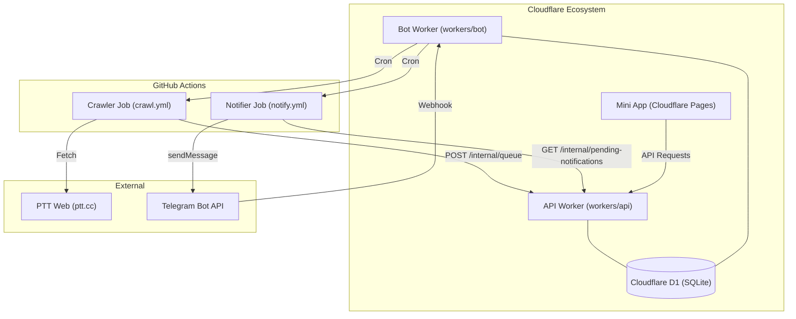

# GEMINI.md - PTT Notify Bot

## Project Overview
PTT Notify Bot is a real-time notification service that monitors PTT (Taiwan's largest terminal-based forum) boards and dispatches updates to users via Telegram. It is built using a modern, serverless, and decoupled architecture designed for high efficiency and low cost.

### System Architecture
The project is divided into four main components that interact through a Cloudflare D1 database and internal API endpoints.



## Key Components

- **Bot Worker (`workers/bot`)**: The entry point for Telegram Webhook interactions and the orchestrator for scheduled cron jobs. It manages the `crawl_queue` and dispatches GitHub Action workflows.
- **API Worker (`workers/api`)**: The backend service for the Telegram Mini App and the internal data gateway for the Crawler and Notifier. It handles authentication via Telegram `initData`.
- **Crawler (`crawler/crawler.py`)**: A Python-based scraper running on GitHub Actions. It fetches the latest articles from PTT and filters them based on user subscriptions and keywords before enqueuing them in the database.
- **Notifier (`crawler/notify.py`)**: Responsible for fetching pending notifications from the API and sending them to users via the Telegram Bot API. It handles message formatting and subscription tier logic.
- **Mini App (`miniapp/`)**: A pure HTML/JS/CSS frontend that allows users to manage their board subscriptions and keyword filters within the Telegram interface.

## Key Technologies
- **Backend**: TypeScript, Cloudflare Workers, grammy (Telegram Bot Framework)
- **Database**: Cloudflare D1 (SQLite)
- **Crawler/Notifier**: Python 3.12, httpx, BeautifulSoup4
- **Frontend**: Vanilla HTML/JS/CSS (Telegram Mini App)
- **CI/CD**: GitHub Actions for both deployment and scheduled tasks.

## Notification Features & Formatting

### Keyword Highlighting
When a user sets keywords for a board, the bot automatically highlights matching terms in the article title using **Bold** and __Underline__ formatting.
- **Logic**: Implemented in `crawler/notify.py` using HTML tags (`<b><u>...</u></b>`).
- **Data Flow**: The Notifier joins `pending_notifications` with `subscription_filters` using a case-insensitive board match to ensure consistent keyword retrieval.

### Subscription Tiers
- **Free Tier**: Users can subscribe to up to 2 boards with 1 keyword per board for free.
- **Advanced Features**: Users can unlock full notifications for more boards and more keywords by watching an advertisement (valid for 24 hours).

## Building and Running

### Development Commands
#### Workers (Bot & API)
```bash
# In either workers/bot or workers/api
npm install
npm run dev          # Start local development server
npm run typecheck    # Run TypeScript type checking
```

#### Database (D1)
```bash
# Initialize local D1 database
cd workers/bot
npx wrangler d1 execute ptt-notify-bot-db --local --file=src/db/schema.sql

# Execute SQL on remote production database
npx wrangler d1 execute ptt-notify-bot-db --remote --file=src/db/schema.sql
```

## Development Conventions
- **Shared Code**: Shared types and configurations are located in `workers/shared/`.
- **Database Access**: All D1 queries are centralized in `queries.ts`. `workers/api` re-exports queries from `workers/bot` to maintain consistency.
- **Security**: Internal communication between GitHub Actions and the API Worker is protected by an `INTERNAL_SECRET` header.

## Troubleshooting

### Keywords Not Highlighted
If keywords are not appearing as bold/underlined in notifications:
1. **Check Casing**: Ensure the board name casing in your subscription matches the notification (the system now uses case-insensitive joins to mitigate this).
2. **Verify Notifier Logs**: Check the GitHub Actions logs for `notify.yml` to see if keywords are being correctly parsed from the database.
3. **Parse Mode**: The Notifier uses `parse_mode: "HTML"`. Ensure no other middleware is overriding the message formatting.
